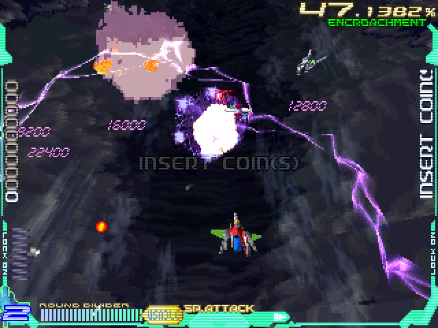
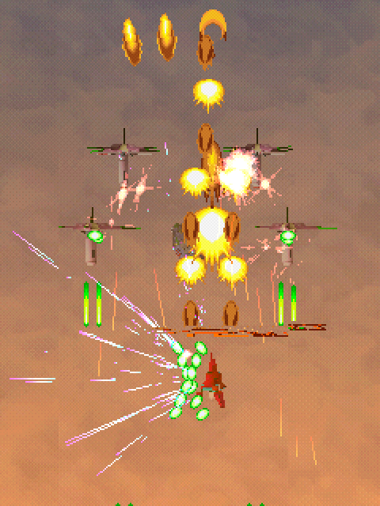
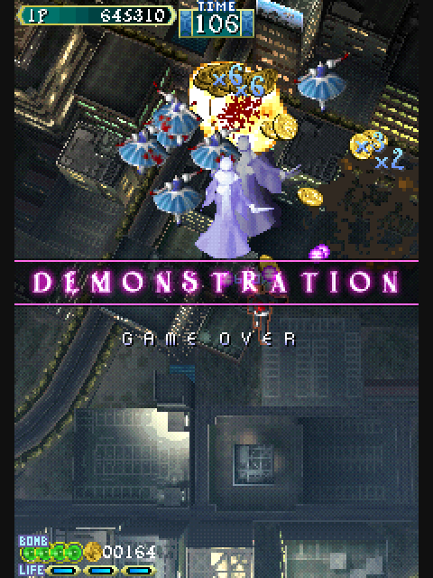
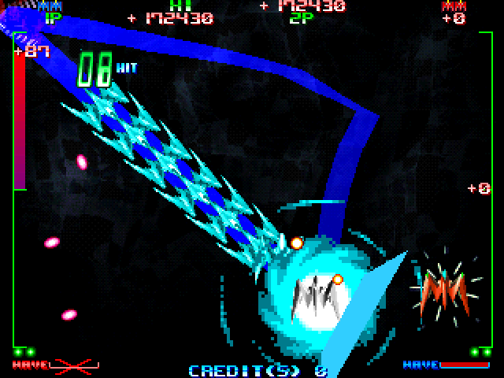
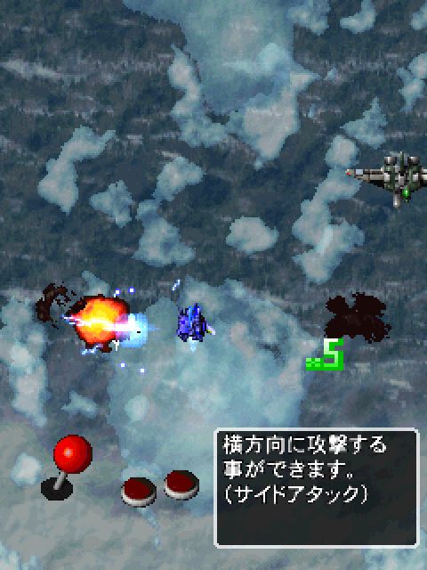

# Taito G-NET - MiSTer FPGA Core (alpha)

A MiSTer core for Taito G-NET: Sony's ZN-2 main board (a PlayStation
derived arcade board) with Taito's FC PCB on top, which carries the
Taito Zoom sound board, five flash chips and the PC card slot the games
are sold on. The core is built on Robert Peip's
[PSX_MiSTer](https://github.com/MiSTer-devel/PSX_MiSTer). I wrote the
ZN-2 board layer, the G-NET glue (flash, PC card, watchdog) and the Taito
Zoom sound board (MN10200, ZSG-2, TMS57002) for this core.

    

*Screenshots taken on a MiSTer with this core.*

## Status

**Alpha.** There are MRAs for all 30 MAME 0.288 G-NET sets on Taito
cards. On my MiSTer I have played 7 of them and seen 20 more boot; 3 are
not tested yet. The results are from 2026-10-06 and 2026-10-07, on this
release's RBF or test builds just before it. Some timings differ from the real board
(see Known issues). I am publishing it to get test reports, especially
from people who own a G-NET board.

**To install, follow [docs/INSTALL.md](docs/INSTALL.md).** Each game needs
a zip made with the converter: a zip made by hand does not work.

## Games

Played: played on my MiSTer. Boots: reached its title, attract or
calibration screen on my MiSTer, not played. MRA: **main** is
`releases/<Game>.mra`; **alt** is in `releases/_alternatives/_<Game>/`.

| Game | Version | Set | Card | MRA | Status | Notes |
|---|---|---|---|---|---|---|
| Chaos Heat | V2.09O | chaoshea | Type 1 | main | Played | |
| Chaos Heat | V2.08J | chaosheaj | Type 1 | alt | Boots | |
| Flip Maze | V2.04J | flipmaze | Type 1 | main | Boots | 480i |
| Go By RC | V2.03O | gobyrc | Type 2 | main | Boots | RC wheel; boots to its calibration screen |
| RC De Go | V2.03J | rcdego | Type 1 | alt | Boots | Japanese Go By RC, in `_Go By RC`; RC wheel; boots to its calibration screen |
| Kollon | V2.04JA | kollon | Type 1 | main | Boots | 480i |
| Kollon | V2.04JC | kollonc | CompactFlash | alt | Boots | Quick start only |
| Mahjong Oh | V2.06J | mahjngoh | Type 1 | main | Boots | Mahjong panel and P1 stick |
| Night Raid | V2.03J | nightrai | Type 1 | main | Played | |
| Otenami Haiken | V2.04J | otenamih | Type 1 | main | Boots | No Zoom board |
| Otenami Haiken Final | V2.07JC | otenamhf | CompactFlash | main | Boots | No Zoom board; quick start only; 480i |
| Otenki Kororin | V2.01J | otenki | Type 1 | main | Boots | |
| Psyvariar -Medium Unit- | V2.02O | psyvaria | Type 1 | main | Played | Vertical |
| Psyvariar -Medium Unit- | V2.04J | psyvarij | Type 1 | alt | Not tested | Vertical |
| Psyvariar -Revision- | V2.04J | psyvarrv | Type 1 | main | Played | Vertical; played to the end |
| Ray Crisis | V2.03O | raycris | Type 1 | main | Played | |
| Ray Crisis | V2.03J | raycrisj | Type 1 | alt | Played | |
| Shanghai Sangokuhai Tougi | Ver 2.01J | shangtou | Type 1 | main | Boots | |
| Shanghai Shoryu Sairin | V2.03J | shanghss | Type 1 | main | Boots | |
| Shikigami no Shiro | V2.03J | shikigam | Type 1 | main | Played | Vertical |
| Shikigami no Shiro | V1.02J internal build | shikigama | Type 1 | alt | Not tested | Vertical |
| Soutenryu | V2.07J | soutenry | Type 1 | main | Boots | |
| Space Invaders Anniversary | V2.02J | sianniv | Type 1 | main | Boots | Vertical; no Zoom board |
| Super Puzzle Bobble | V2.05O | spuzbobl | Type 2 | main | Boots | |
| Super Puzzle Bobble | V2.04J | spuzboblj | Type 2 | alt | Boots | |
| Usagi | V2.02J | usagi | Type 2 | main | Boots | Mahjong panel |
| XII Stag | V2.01J | xiistag | Type 1 | main | Boots | Vertical; runs to its gameplay demo |
| Zoku Otenamihaiken | V2.03J | zokuotena | Type 1 | main | Boots | No Zoom board |
| Zoku Otenamihaiken | V2.05J | zokuoten | Type 2 | alt | Not tested | No Zoom board; I do not have this card |
| Zooo | V2.01JA | zooo | Type 1 | main | Boots | No Zoom board |

The main MRA of each game is MAME's parent set. Vertical games rotate for
HDMI in the OSD. "No Zoom board" sets do not use the Taito Zoom sound
board (MAME `init_nozoom`); their sound comes from the PlayStation SPU. The
CompactFlash sets have no first boot MRA ([docs/INSTALL.md](docs/INSTALL.md#5-play)). Zip names,
card types and the game configuration byte of each set are in
[releases/README.md](releases/README.md).

## Not supported yet

- **Mawasunda.** It runs on the ZN-1 G-NET board (`coh1002t`), not the
  ZN-2.
- **The 2011 conversions:** G-Darius, Ray Storm, Aero Fighters Special,
  Brave Blade, Flame Gunner, Fighters' Impact, Shanghai Matekibuyuu and
  The Block Kuzushi. They boot from a modified BIOS on a plain ATA card.

## Installation

Follow the step by step guide: **[docs/INSTALL.md](docs/INSTALL.md)**. Update All
(shmupfan database) or a copy of `releases/` installs the core and MRAs. You add
your MAME 0.288 `coh3002t.zip` and a `gnet_<set>.zip` per game, made from your
CHDs with the converter at **<https://gnet-converter.pages.dev>** (it runs in your
browser and uploads nothing), in `/media/fat/games/mame/`. No game data is included.

## Controls

Two players, an 8-way stick and three buttons each, plus Start, Coin,
Service, Test and Pause. MAME gives no button names for these games and I
have not found the game manuals, so the buttons are Button 1 to 3.

| Function | Joypad (default) | Keyboard, player 1 | Keyboard, player 2 |
|---|---|---|---|
| Buttons 1, 2, 3 | A, B, X | Left Ctrl, Left Alt, Space | A, S, Q |
| Start | Start | 1 | 2 |
| Coin | Select | 5 | 6 |
| Service | L | 9 | |
| Test | R | F2 | |
| Pause | map it in the OSD | P | |

Movement is the stick or D-pad, the arrow keys for player 1, and R, F, D,
G for player 2. The keyboard keys are MAME's defaults.

Four sets use other controls, as MAME 0.288 maps them:

- **Mahjong panel** (Mahjong Oh, Usagi), on the keyboard with MAME's
  default keys: A to N for the tiles, Left Ctrl Kan, Left Alt Pon, Space
  Chi, Left Shift Reach, Z Ron, 1 Start. Mahjong Oh also keeps the player
  1 stick and buttons; Usagi has neither.
- **RC wheel and trigger** (Go By RC, RC De Go), one player: the analog
  stick's X axis or a paddle steers, the stick's Y axis is the trigger;
  the D-pad or arrow keys give full deflection. With a fresh EEPROM the
  game stops on its CALIBRATION screen, as it does in MAME: leave the
  stick centred and press Start. The game saves the calibration to the
  EEPROM.

## OSD options

- **Aspect ratio** and **Scale** (HDMI): Original is 4:3 for the area the
  game draws, as an arcade monitor adjusted to fill the tube shows it.
  There is no 216p crop: the games use 240 lines, and a 216-line crop
  would cut part of the picture.
- **Orientation** and **Rotate Direction** (vertical games, HDMI): stand
  the picture upright on a horizontal screen.
- **Flip Screen** (vertical games): turns the picture 180 degrees for a
  monitor rotated the other way. It works on a CRT and over HDMI.
- **Scandoubler Fx**: HQ2x or CRT scanlines for 31 kHz output.
- **CRT H Position** and **CRT V Position**: move the picture in 2 pixel
  steps (-16 to +14) and whole lines (-4 to +3). Only the sync pulses
  move; the game's timing stays as it is. Vertical sync starts and ends on
  a horizontal sync edge, so a CRT gets a clean composite sync.
- **Pause when OSD is open**, plus the Pause button and the P key.
- **Volume**: Normal, +6 dB, -6 dB, -12 dB.
- **SFX Level**: the PlayStation SPU's level in the mix against the Zoom
  board: 0.3 (MAME's setting, the default), 0.45, 0.6, 0.9, 1.2, 1.5.
- **DIP switches**: S551. Switch 4 is Test Mode (the operator manual says
  to use switch 4 only); switch 2 is the BIOS service mode in MAME;
  switches 1 and 3 are unknown. Leave them off for normal play.
- **Watchdog**: leave it On. It resets a game that stops running, as the
  board's MB3773 does. Off is for debugging.
- **Debug overlay**: a small box of hex numbers with the board state, for
  test reports ([docs/TESTING_GUIDE.md](docs/TESTING_GUIDE.md)).

The screen stays black, with sync running, while the MRA loads and while
the core resets, so a CRT keeps its picture. The pixel clock is an exact
division of the 53.693175 MHz video clock in every mode the games use
(256, 320, 512 and 640 dots), so direct video shows even pixel widths.

The board's EEPROM (settings and high scores) is saved to the SD card as
NVRAM when the OSD opens after the game has written to it.

## Known issues

- **Loading is slower than on the board.** The CPU spends about 9.6 of its
  cycles on each main RAM load where the real chip needs about 7, so
  CPU-bound work runs slow. Ray Crisis's "Prepares the start." bar takes
  about 16.9 s on the core, 14.69 s on a real board and 12.3 s in MAME.
  Screens after the loaders come 1.5 to 5 s later than in MAME.
- **480i games on a CRT.** Flip Maze, Kollon and Otenami Haiken Final draw
  480-line interlaced screens (512 or 640 by 480). On a 15 kHz CRT the
  picture does not look right yet (fine detail shimmers), and the
  Deinterlacing option is not offered in that mode. The 240-line games
  are not affected.
- **Sound balance.** The SFX Level default follows MAME (0.3). The core also applies the SPU main volume the games set,
  which MAME ignores, so at 0.3 the effects are 2.5 to 14.1 dB quieter
  than in MAME, depending on the game. One phone recording of a real
  Psyvariar -Revision- cabinet suggests 0.6 to 0.8 for that game, but 0.7
  sounded wrong for Night Raid. A line-out recording of a board would
  settle it.
- **Card writes are not saved.** Some games write a few sectors to their
  PC card (what they hold is not known yet). The core keeps those writes
  only until the core is reloaded.
- **First boot MRAs** repeat the 2.5 minute copy at every load, because
  the flash chips are not saved. I have not yet confirmed the copy on my
  own hardware.
- **Watchdog period.** The core uses 8 s where MAME uses 5 s. The board's
  real period is not known (the timing capacitor's value is not legible
  in any photo I have found).
- **Frame rate.** The core runs at 59.817 Hz (3413 x 263 at 53.693175 MHz).
  MAME and a note from a real board give 59.826 Hz. A cabinet recording
  agrees with MAME to about 0.3%, which cannot tell the two apart; a
  frequency counter on a board would.
- **Not yet checked on hardware:** play in the sets marked Boots; the 3
  sets marked Not tested; slowdown in heavy scenes against a real board;
  the EEPROM save across a power cycle; rotation and Flip Screen on every
  display.

## Accuracy

[docs/ACCURACY.md](docs/ACCURACY.md) has the evidence for each subsystem
and every known difference from MAME and from the real board. The Taito
Zoom board was checked against MAME instruction by instruction and sample
by sample. The core differs from MAME 0.288 on purpose in three places:

- **GPU:** it matches the PS1 hardware test images of JaCzekanski's
  ps1-tests, which MAME does not, and keeps the ZN-2's 2 MB VRAM.
- **ZSG-2:** the volume readback is 13 bits, as in MAME's later fix
  (commit 61c7940). MAME 0.288 returns 16 bits, which corrupts the Zoom
  sound driver's voice allocator.
- **TMS57002:** it follows the TI User's Guide on the multiplier input
  width, the coefficient update rule and the 16-bit serial input.

## How to help

The [testing guide](docs/TESTING_GUIDE.md) lists the tests, what each game
should show, and how to report. The most useful reports are play
reports for the sets marked Boots or Not tested, a first boot copy run
to the end, and anything from a real G-NET board: timings, recordings
and the measurements listed at the end of the guide.

## Building

- Synthesis: Quartus 17, project `PSX.qpf`, revision `GNET_Z1FULLO`.
  Releases are built only from a fit with every clock meeting timing.
  `Arcade-TaitoGNET_20261007.rbf` is the GNET_Z1FULLO build of the RTL in
  this repository (Quartus 17.0.2, every clock met).
- Simulation: NVC 1.23 and Verilator 5.x benches in `sim/`. The MAME
  reference traces need MAME 0.288 and your own files; the trace scripts
  are in `tools/mame/`. Game-derived data from these runs stays in
  gitignored folders.
- The MRAs are generated by `tools/gnet/make_release_mras.py`.
- The design notes in `docs/` are a development log. They mention build
  revisions, test MRAs and scripts that are not in this repository.
- The MAME 0.288 sources used as the reference are not copied into the
  repository; [docs/mame_sources.md](docs/mame_sources.md) links each one
  at the exact version, with its md5.

### How the core is built

- PSX_MiSTer (Robert Peip): CPU, GTE, GPU, SPU, DMA, timers, IRQ. The CD,
  memory card, pad, MDEC and savestate paths are removed behind build
  switches; the G-NET games do not use them.
- CPU group at 50.000 MHz with the GTE at 100 MHz; GPU and SPU on their
  own clocks, as on the ZN-2.
- ZN-2 board layer: 4 MB main RAM, 2 MB VRAM, BIOS, two CAT702 security
  chips, the I/O MCU model, the AT28C16 EEPROM, inputs.
- G-NET FC PCB: five Intel flash chips with their command set, the
  RF5C296 PC card controller, the Taito Type 1, Type 2 and CompactFlash
  ATA cards with their unlocks, control registers and the MB3773
  watchdog.
- Taito Zoom: MN10200 sound CPU, ZSG-2 wavetable chip, TMS57002 effects
  DSP, M66220 mailbox, MB87078 volume.
- Memory: main RAM, BIOS and flash in SDRAM; VRAM, SPU RAM, the card
  image and a copy of the flash area for the Zoom board in DDR3, behind a
  DDR3 arbiter that also serves HDMI rotation.

```
PSX.sv, PSX.qpf               MiSTer shell and Quartus project
GNET_Z1FULLO.qsf, GNET_*.sdc  release revision and its timing constraints
PSX.qsf, PSX_DualSDRAM.*      upstream PSX_MiSTer revisions
rtl/                          PSX_MiSTer core (upstream), with trims behind switches
rtl/gnet/                     ZN-2 board layer, G-NET glue, shell blocks, DDR3 arbiter
rtl/zoom/                     Taito Zoom: MN10200, ZSG-2, TMS57002, board glue
sys/                          MiSTer framework
releases/                     released RBF and MRA files (releases/README.md)
docs/                         accuracy notes, design notes and findings
docs/images/                  screenshots taken on a MiSTer with this core
sim/                          NVC and Verilator benches against MAME traces
tools/                        card, flash and MRA tools, MAME trace scripts
```

### MRA format

For anyone writing MRAs for this core:

| ioctl index | Content | Source |
|---|---|---|
| 0 | BIOS `m534002c-60.ic353` (512 KB) | coh3002t.zip |
| 2 | CAT702 keys `tt10.ic652`, `tt16.u17` | coh3002t.zip |
| 3 | flash area, 10 MB: U30 sub-BIOS, U27 Zoom program, U56/U55/U29 wave data | `<set>.flash` from the game zip (quick start), or `flash.u30` plus 8 MB of FFh (first boot) |
| 4 | card identify data, CIS, key and card type at 3F0h (01 Type 1, 02 Type 2, 03 CompactFlash) (1 KB) | `<set>.meta` from the game zip |
| 5 | PC card image (whole sectors, up to 64 MB) | `<set>.img` from the game zip |
| 6 | EEPROM (2 KB), `<nvram index="6" size="2048"/>` | saved by MiSTer |
| 7 | game configuration byte: bit 0 vertical set (MAME ROT270), bit 1 no Taito Zoom board (MAME `init_nozoom`), bits 3:2 controls (0 stick, 1 mahjong panel and P1 stick, 2 mahjong panel, 3 RC wheel and trigger) | inline in the MRA |
| 254 | bits 3-0 DIP switch S551, bit 4 JP1 | MRA switches |

JP1 (BIOS Flash) is open in every MRA and the OSD does not offer it. With
JP1 closed the BIOS runs its flash initialise on every boot and the game
never starts. MAME 0.288 closes JP1 by default for Kollon (V2.04JC) and
Otenami Haiken Final so its flasher can run first; these MRAs keep it
open for a normal boot.

## License and credits

The files I wrote carry GPL-2.0-or-later headers, the same as PSX_MiSTer's
PSX.sv, so they can go back upstream unchanged. The combined core and its
bitstream are GPL-3.0-or-later, because the MiSTer framework files are
([docs/licensing.md](docs/licensing.md)). `LICENSE` holds PSX_MiSTer's
GPLv2 text and `LICENSE-GPL3` the GPLv3 text. Files from other projects
keep their own licences and headers.

- **[PSX_MiSTer](https://github.com/MiSTer-devel/PSX_MiSTer)** by Robert
  Peip is the base of the core: CPU, GTE, GPU, SPU and the rest of the
  PlayStation hardware, with contributions from kuba-j, birdybro and
  others (the full upstream history is kept in this repository). The
  MiSTer framework is by Sorgelig and contributors.
- **MAME** is the behavioural reference for everything without a better
  source: the taitogn, zn and taito_zm drivers and the zsg2, tms57002,
  mn10200, psx, cat702, rf5c296, ataflash and mb3773 devices, by smf,
  Olivier Galibert, R. Belmont, hap, superctr, cam900, Aaron Giles,
  pSXAuthor and the other MAME developers. The core follows superctr's
  later ZSG-2 fix (MAME commit 61c7940).
- **psx-spx** (Martin "nocash" Korth and contributors) for the PlayStation
  hardware, and JaCzekanski's **ps1-tests** for GPU behaviour.
- **Datasheet and manual authors:** Texas Instruments (TMS57002 User's
  Guide), Fujitsu (MB3773, MB87078), Intel (28F160S5, 28F160S3, 28F400B5),
  Ricoh (RF5C296), Analog Devices (ADM708), IDT (R3051/R3052), LSI Logic
  (CW33000), Panasonic (MN102H and MN102L manuals), Mitsubishi (M66220),
  Atmel (AT28C16), Sanyo (LC321664), the CompactFlash Association, and
  Taito (the G-NET operator manual).
- **Board photos and recordings:** System 16, bytestorm and the
  arcade-projects forum members whose traces and notes are cited in
  docs/ACCURACY.md, westtrade, Gamers Bay and The Obsolete Geek for PCB
  footage.
- XelaNotPu's ZN-1 and ZN-2 cores informed my feasibility study and the
  area budget (measured fits); no code was taken from them.

Development used [Claude Code](https://claude.com/claude-code), Anthropic's AI coding tool.
